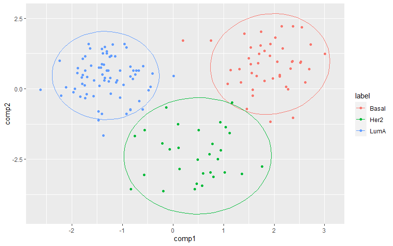
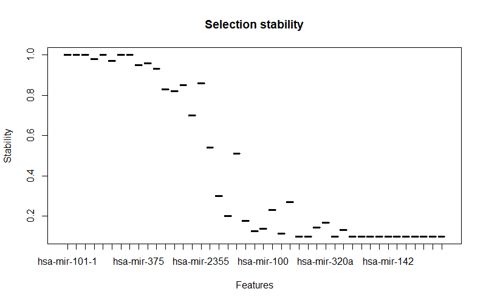
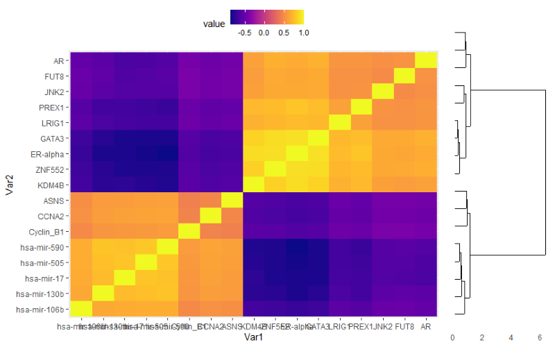
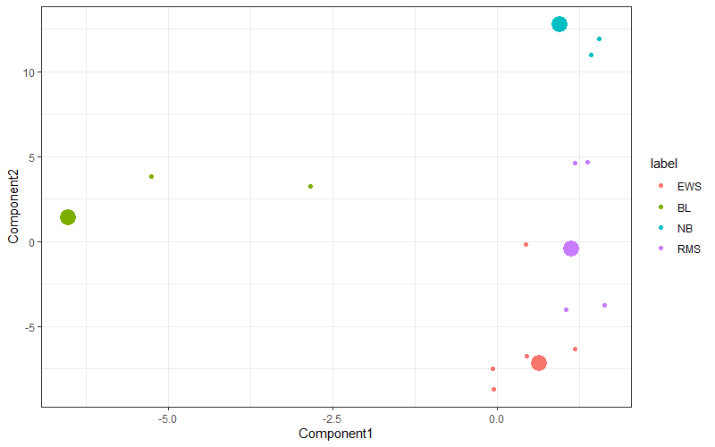

# Getting Started with Model Analysis

The following functions are provided to assist in the analysis and visualisation
of a model fitted by `mixOmics`.  Focus has been given to sPLS-DA models where a
single block is being fitted (single-omics) and to DIABLO models where multiple
blocks are being fitted simulataneously (multi-omics).  The code below will
generate known trained models and corresponding performance tests for each model
type, which are then used to demonstrate the functions in the rest of this
document.

```R
library(interfold.bio)
library(mixOmics)
library(dplyr)

#######################################
## sPLS-DA model and performance result
#######################################

# Prepare data
data(srbct)
splsda.X <- srbct$gene
splsda.Y <- srbct$class

# Model fit
splsda.ncomp <- 3
splsda.keepX <- c(9, 280, 30)
splsda.model <- splsda(splsda.X, splsda.Y,
                       ncomp = splsda.ncomp, keepX = splsda.keepX)

# Preformance result -- takes about 1 min to run
set.seed(1234) # for reproducibility
splsda.perf <- perf(splsda.model, validation = "Mfold", folds = 5,
                    dist = 'max.dist', nrepeat = 10,
                    progressBar = FALSE)


######################################
## DIABLO model and performance result
######################################

# Prepare data
data('breast.TCGA')
diablo.data <- list(mRNA = breast.TCGA$data.train$mrna, 
                    miRNA = breast.TCGA$data.train$mirna, 
                    proteomics = breast.TCGA$data.train$protein)
diablo.Y <- breast.TCGA$data.train$subtype
diablo.design <- matrix(0.1, ncol = length(diablo.data),
                        nrow = length(diablo.data), 
                        dimnames = list(names(diablo.data), names(diablo.data)))
diag(diablo.design) <- 0

# Model fit
diablo.ncomp <- 2
diablo.keepX <- list(mRNA = c(6, 14), miRNA = c(5, 18), proteomics = c(6, 7))
diablo.model <- block.splsda(X = diablo.data, Y = diablo.Y,
                             ncomp = diablo.ncomp, keepX = diablo.keepX,
                             design = diablo.design)

# Preformance result -- takes about 1 min to run
set.seed(4321) # for reproducibility
diablo.perf <- perf(diablo.model, validation = 'Mfold', M = 10, nrepeat = 10, 
                    dist = 'centroids.dist')
```

## Model variance analysis

InterFold provides the [`get.block.centroids()`](#get-block-centroids) function
to extract the centroids of variance across blocks in a DIABLO model and export
them as a data frame and plot.  The
[`get.model.variance()`](#get-model-variance) function is also provided which
will take either an sPLS-DA model or a DIABLO model as input and creates a data
frame showing the percentage contributions of each component to the model
variance.

### Get block centroids

Applying the `get.block.centroids()` function to the DIABLO model from above
gives the following:

```R
get.block.centroids(diablo.model)
## A tibble: 150 x 4
## Groups:   sample [150]
##    sample label comp1   comp2
##     <int> <fct> <dbl>   <dbl>
##  1      1 Basal  2.38  2.22  
##  2      2 Basal  1.74  2.03  
##  3      3 Basal  2.28 -0.0206
##  4      4 Basal  1.54  1.46  
##  5      5 Basal  1.93 -1.17  
## ... with 145 more rows
```

In addition to the tibble provided, a plot is produced showing the centroid
across the blocks in the first and second component for each sample in the data.
Each point in the plot represents a sample and is the mean of the three blocks
loaded for the DIABLO model.  The circles show the distribution of all the
points sharing the same label and gives a good indication of the separation of
classifications in each of the first two components.



### Get model variance

The `get.model.variance()` function can be applied to the model to identify how
much variation each component captures in the model for a given block:

```R
get.model.variance(diablo.model, "mRNA")
##        Proportion Cumulative
## comp1 0.794465823  0.7944658
## comp2 0.008624793  0.8030906

get.model.variance(diablo.model, "miRNA")
##        Proportion Cumulative
## comp1 0.669987181  0.6699872
## comp2 0.001283394  0.6712706

get.model.variance(diablo.model, "proteomics")
##        Proportion Cumulative
## comp1 0.770439163  0.7704392
## comp2 0.002689493  0.7731287
```

Here we can see that the first component captures the vast majority of the
variance for all three blocks but that slightly less of the variance in `miRNA`
was captured than in `mRNA` or `proteomics`.

## Feature analysis for sPLS-DA models

InterFold provides functions for analysing the features selecting for fitting
sPLS-DA models.

- [`get.loadings.table()`](#get-feature-loadings-as-a-table) outputs a data
  frame of loadings for features selected in each component of the model.
- [`feature.selection.stability()`](#get-spls-da-feature-selection-stability)
  gives the loadings from above for a single component, alongside stability
  scores for the selected features.
- [`merge.feature.stability()`](#merge-feature-stability-on-a-table-of-loadings)
  takes a table such as that generated by `get.loadings.table()` and the output
  from `feature.selection.stability()` merging them into a single data frame.

### Get feature loadings as a table

By calling `get.loadings.table()` with the sPLS-DA model as a parameter, a data
frame will be produced listing the loadings of each feature selected for the
sparse feature set.  A separate column is included for each component and the
features are arranged according to their loading value in the earliest component
they are selected for.  Ordering is highest loading first.  Where a feature is
selected in more than one component, it appears only once in the table, showing
both loadings values.  Where features are not selected for a component, the
loading value is `NA`.

The code example below demonstrates typical output from this function.  The
output has been truncated for brevity in this getting started guide.  The actual
output is 320 lines long.

```R
get.loadings.table(splsda.model)
##            comp1         comp2       comp3
## g123  0.64922048            NA          NA
## g846  0.44828969            NA          NA
## g1606 0.30641602            NA          NA
## ...
## g1389         NA -2.312917e-01          NA
## g246          NA -2.001212e-01          NA
## g545          NA -1.986890e-01          NA
## ...
## g340          NA -4.226175e-02          NA
## g742          NA  4.204118e-02  0.14003503
## g1143         NA -4.124087e-02          NA
## ...
## g174          NA            NA -0.35418530
## g1896         NA            NA -0.29939099
## g603          NA            NA -0.27261886
```

### Get sPLS-DA feature selection stability

Calling `feature.selection.stability()` with the model, performance test result
and a component number as parameters generates a data frame showing the loadings
values are were returned above, but for a single component only.  The second
column in the data frame gives the stability value of the feature.  This is
expressed as a fraction and indicates how many of the models in the performance
test included this feature in the sparse set.  High stability indicates that a
feature is very important to the fit of the model and is therefore probably
important to separating the classes the model is trying to discriminate.

The example below shows extraction of the stability values for the 9 top
features included in component 1.  Note how all stabilities are an exact
multiple of 0.02.  This is because our performance test used 10 repeats and 5
folds, so 50 models were fitted, and each time a model selects a feature, this
adds 0.02 to the stability of that feature.

```R
feature.selection.stability(splsda.model, splsda.perf, 1)
##            value stability
## g123  0.64922048      0.50
## g846  0.44828969      0.50
## g1606 0.30641602      0.40
## g335  0.30031495      0.48
## g836  0.26392532      0.46
## g783  0.22022625      0.28
## g758  0.22019689      0.38
## g1386 0.16248889      0.38
## g585  0.02058632      0.12
```

### Merge feature stability on a table of loadings

After getting the loadings table for all the components of the model, it is
probably desirable to create a table with stability values shown in a final
column.  `merge.feature.stability()` can be called with the loadings table and
stability table as parameters.  The returned data frame adds a column for the
stability values matching the features in the loadings table.  `NA` is used
where the stability value for a feature was not in the stability table.

Output for the loadings table is truncated in the example below for brevity.
You will see the full output in your own R instance.

```R
# Prepare the loadings table and stability value table we intend to merge on.
loadings.table <- get.loadings.table(splsda.model)
stability.comp3 <- feature.selection.stability(splsda.model, splsda.perf, 3)

# Check the raw loadings table before merging any stability values.
loadings.table
##            comp1         comp2       comp3
## g123  0.64922048            NA          NA
## g846  0.44828969            NA          NA
## g742          NA  4.204118e-02  0.14003503
## g1143         NA -4.124087e-02          NA
## g174          NA            NA -0.35418530
## g1896         NA            NA -0.29939099

# Merge on stability values for component 3.
merge.feature.stability(loadings.table, stability.comp3)
## feature      comp1         comp2       comp3 stability
##    g123 0.64922048            NA          NA        NA
##    g846 0.44828969            NA          NA        NA
##    g742         NA  4.204118e-02  0.14003503      0.76
##   g1143         NA -4.124087e-02          NA        NA
##    g174         NA            NA -0.35418530      0.34
##   g1896         NA            NA -0.29939099      0.32
```

## Feature analysis for DIABLO models

InterFold provides a number of functions for analysing the output from DIABLO
models produced in `mixOmics`.

- [`get.diablo.top.loadings()`](#get-diablo-top-loadings) outputs a data frame
  of feature loadings for a specified block in the DIABLO model.
- [`diablo.selection.stability()`](#get-diablo-feature-selection-stability)
  extracts a data frame of stability scores from a DIABLO model performance test
  for features in a particular block and component.
- [`get.diablo.top.loadings.with.stability()`](#get-diablo-top-loadings-with-stability)
  provides a concatenated data frame of feature loadings and stability scores
  for a given block in the DIABLO model.
- [`get.diablo.top.features()`](#get-diablo-top-features) applies a correction
  factor to stability scores so that features can be ranked across different
  blocks and different components, returning a sorted data frame of features in
  the model.
- [`plot.feature.stability()`](#plot-feature-stability) provides a simple
  histogram plot of the highest stability features in a single component and
  block, allowing visual comparison of their stability scores.
- [`find.feature.associations()`](#find-diablo-feature-associations) outputs a
  matrix of values indicating possible feature associations in the model based
  on consistent feature measurement across samples.
- [`export.matrix.as.network()`](#export-diablo-matrix-as-a-network) exports a
  data frame showing relationships between features where feature association
  strength exceeds a threshold.  The data frame is also written to a CSV file
  which can be imported into a network plotting application such as
  [Cytoscape](https://cytoscape.org/).

### Get DIABLO top loadings

`get.diablo.top.loadings()` allows the export of loadings from a DIABLO model
into a data frame.  The resulting data frame has columns for each component of
the model containing loadings for the features selected in that component.  Rows
are sorted according to the absolute value of the loadings so that the highest
impact features are at the top of the table.  All features for the first
component are listed before listing begins for features of the second and
subsequent components.  If a feature is selected in more than one component,
only one row is given for that feature but multiple columns will contain a
loading for that feature.  Where a feature was not selected in a component, the
`NA` value is shown for the loading.

In the example below, the loadings for the `proteomics` block are being arranged
in the data frame.  Note that feature `AR` has been selected in both components.
Because its loading value in component 2 is `-0.11183919`, this would normally
place `AR` below `c-Kit`, but features are sorted by lower numbered components
first.

```R
get.diablo.top.loadings(diablo.model$loadings$proteomics)
##                   comp1       comp2
## ER-alpha    -0.74995295          NA
## GATA3       -0.62448770          NA
## ASNS         0.16825721          NA
## Cyclin_B1    0.12026614          NA
## AR          -0.06842432 -0.11183919
## JNK2        -0.01137347          NA
## HER2                 NA -0.67182918
## HER2_pY1248          NA -0.62130938
## EGFR_pY1068          NA -0.33229248
## c-Kit                NA  0.17791016
## HER3_pY1289          NA -0.08706226
## XRCC1                NA  0.02149536
```

### Get DIABLO feature selection stability

`diablo.selection.stability()` is very similar to the [equivalent function for
sPLS-DA models](#get-spls-da-feature-selection-stability).  By passing the
performance test result, a selected component and a selected block as
parameters, a data frame will be generated for the features in that block and
component, showing the stability scores for those features.  Stability is a
fraction indicating the number of models in the performance test which selected
this feature when being fitted.  100 models were fitted when running the DIABLO
performance test (10 repeats with 10 folds), so the stability scores shown are
an exact multiple of `0.01`.  Features are presented in the data frame in
reverse stability score order so that the most stable features are shown first.
Those with a score of `1.0` are essential for the model to achieve the best fit
and are therefore also likely to be relevant to the discrimination of classes
the model is trying to achieve.

The code below outputs the feature selection stability for the `proteomics`
block in component 1.

```R
diablo.selection.stability(diablo.perf, comp = 1, block = 'proteomics')
##   feature stability
##  ER-alpha      1.00
##     GATA3      1.00
##      ASNS      0.99
## Cyclin_B1      0.98
##        AR      0.80
##      JNK2      0.54
##        PR      0.41
## Cyclin_E1      0.22
##    INPP4B      0.12
```

### Get DIABLO top loadings with stability

`get.diablo.top.loadings.with.stability()` allows the combination of information
from both the previous functions.  By passing in the model, performance test and
block name, a data frame is generated with loadings of the selected features for
each component alongside stability scores for those features.  Where a feature
exists in more than one component, the stability score shown is for the lowest
numbered component.

The code below generates a data frame containing loading values and stability
scores for the selected features in the `proteomics` block.  Note that, unless
specified, the number of features returned will be up to `20` by default.

```R
get.diablo.top.loadings.with.stability(diablo.model, diablo.perf,
                                       block = 'proteomics', feature.count = 50)
##                   comp1       comp2 stability
## ER-alpha    -0.74995295          NA      1.00
## GATA3       -0.62448770          NA      1.00
## ASNS         0.16825721          NA      0.99
## Cyclin_B1    0.12026614          NA      0.98
## AR          -0.06842432 -0.11183919      0.80
## JNK2        -0.01137347          NA      0.54
## HER2                 NA -0.67182918      1.00
## HER2_pY1248          NA -0.62130938      1.00
## EGFR_pY1068          NA -0.33229248      1.00
## c-Kit                NA  0.17791016      1.00
## HER3_pY1289          NA -0.08706226      0.95
## XRCC1                NA  0.02149536      0.56
```

### Get DIABLO top features

`get.diablo.top.features()` generates a data frame with an optimised version of
stability scores for all blocks and all components in the model.  Raw stability
scores, as output in the previous functions, are not directly comparable between
different blocks, different components or between models.  The stability is
influenced by the number of features being sparsely selected from in a block, by
the number of features selected in each component and by the number of repeats
when doing the performance test of the model.  As such we've provided an
algorithm which uses information from the model and performance test,
transforming stability scores using a binomial distribution curve, so that a
rank score can be produced and used for ranking.  This allows all the features
from all the blocks to be compared in a fair manner.

After transforming stability scores, the features are arranged in a data frame
such that the highest rank scores are at the top, with decreasing rank score as
the table continues.  Features with the highest rank scores should also be the
most important features in a biological context to distiguish the
classifications the model was fitted to discriminate between.  Features with a
matching rank score have equal importance to the model fitting process.  Each
feature is shown alongside the block it belongs to, but also to a component
number.  The number shown for the component is the component where this feature
had the highest rank score.  The feature may also be present in the other
component(s), but it would be of lesser or equal importance in those components.

In the code example below, we are generating the rank score data frame for all
the features in the DIABLO model.  The number of features will be lesser than or
equal to the number provided in the `feature.count` parameter.  This can be
useful if your model contains thousands of features.  We can see that the
highest ranked features all have a raw stability of `1.0` and that the rank
score is also `1.0` for these features.  By the end of the table, the rank score
is lower than the stability score.

```R
get.diablo.top.features(diablo.model, diablo.perf, feature.count = 150)
## rank rank.score      block component         feature stability
##    1 1.00000000      miRNA         1    hsa-mir-130b 1.0000000
##    2 1.00000000      miRNA         1      hsa-mir-17 1.0000000
##    3 1.00000000      miRNA         1     hsa-mir-505 1.0000000
##    4 1.00000000      miRNA         1     hsa-mir-590 1.0000000
##    5 1.00000000       mRNA         1           KDM4B 1.0000000
##    6 1.00000000       mRNA         1          ZNF552 1.0000000
##    7 1.00000000 proteomics         1        ER-alpha 1.0000000
##    8 1.00000000 proteomics         1           GATA3 1.0000000
##    9 1.00000000 proteomics         2           c-Kit 1.0000000
##   10 1.00000000 proteomics         2     EGFR_pY1068 1.0000000
## ...
##  109 0.05698361      miRNA         2     hsa-mir-23b 0.1000000
##  110 0.05698361      miRNA         2    hsa-let-7a-1 0.1000000
##  111 0.05698361      miRNA         2     hsa-mir-30d 0.1000000
##  112 0.05698361      miRNA         2     hsa-mir-451 0.1000000
##  113 0.05698361      miRNA         2     hsa-mir-144 0.1000000
```

### Plot feature stability

`plot.feature.stability()` takes a single parameter with a table of stabilities,
as obtained from
[`diablo.selection.stability()`](#get-diablo-feature-selection-stability), and
creates a bar-chart-style plot of stability for those features.  The shape of
the plot will give and indication for how consistently the models choose the
same features during the performance tests.  A plot that stays high for the
first features and then drops sharply to a low level for the remainder shows
that there is a clear preference for specific features and that those features
should be of value to look at more closely in relation to the biological
context.  If the curve is closer to a straight line and only a very small number
of features achieve close to `1.0` stability, then the feature selection is less
stable and it may be harder to draw conclusions about which are relevant to the
biological context.

The code below prepares a stability data frame for the DIABLO performance test
for the `miRNA` block in component 2.  It then plots the stability scores as a
bar-chart-style plot as shown below the code.  This plot shows a reasonably
sharp drop off after about 10 features, which in turn means that the high
stability features on the left are likely to have good relevance to the
biological context.

```R
stability <- diablo.selection.stability(diablo.perf, comp = 2, block = 'miRNA')
plot.feature.stability(stability)
```



### Find DIABLO feature associations

`find.feature.associations()` generates both a matrix of associations between
features and a heatmap of the same data alongside a dendrogram showing
similarity in associations between features.  By passing the trained DIABLO
model and the number of blocks it contains as parameters, a matrix will be
created with fractions indicating the common trends in observations for each
pair of features selected for the sparse model in the first component only.
Only features which are returned by the [top loadings
function](#get-diablo-top-loadings) will be compared.  If a feature has a
pattern of measurement that is exactly consistent with another, when comparing
across the samples, the association will be `1.0`. Where the trend is inverse,
this can be just as informative since there may still be a biological link
between the features.  These associations are represented by negative numbers up
to `-1.0`.

As well as providing this information as a matrix, a plot is generated with the
same information presented as a heatmap where orange and yellow squares indicate
a positive association and purple to violet squares indicate a negative
association.  The ordering of features on the heatmap are according to the
clustering of the association patterns.  Each axis contains the features in the
same order, hence a strong diagonal correlation is shown where features are
associated with themselves.  The heatmap is accompanied by a dendrogram showing
similarity in the associations between features.  Those with branches furthest
to the left of the dendrogram show the most similarity in their associations
with other features.

The following code example will generate the matrix of associations for our
DIABLO model and create the heatmap and dendrogram plot as shown below.  Note
that the output shown is a trimmed version of the full matrix for brevity.  The
heatmap and dendrogram plot is the original.

```R
find.feature.associations(diablo.model, block.count = 3)
##                   KDM4B     ZNF552       FUT8      LRIG1      CCNA2      PREX1
## KDM4B         1.0000000  0.8247985  0.5777819  0.6780996 -0.6194948  0.7235040
## ZNF552        0.8247985  1.0000000  0.6428172  0.7072751 -0.6399958  0.7308222
## FUT8          0.5777819  0.6428172  1.0000000  0.5162760 -0.4628657  0.5168250
## LRIG1         0.6780996  0.7072751  0.5162760  1.0000000 -0.5223886  0.5995716
## CCNA2        -0.6194948 -0.6399958 -0.4628657 -0.5223886  1.0000000 -0.5468418
## PREX1         0.7235040  0.7308222  0.5168250  0.5995716 -0.5468418  1.0000000
```



### Export DIABLO matrix as a network

`export.matrix.as.network()` takes the output of the associations function above
and both filters and converts the matrix to a flat format as a data frame as
well as writing that to a CSV file.  The data frame has one line per association
and does not show reverse associations.  Only associations which meet or exceed
the given cutoff threshold are included.  The association can be positive or
negative to satisfy inclusion by the cutoff.  The data frame shows both sides of
the association as two feature columns and the strength of the association as a
value column.  The block column provides the name of the block containing the
left hand feature.

The CSV file specified is created and contains the same information as the data
frame.  The format of the CSV file is importable into programs for plotting
networks, such as [Cytoscape](https://cytoscape.org/), which makes it easier to
visualise how the features in the model might be relevant to each other.

The code example below prepares the association matrix and then prepares a
vector of strings where the string names are the names of the blocks each of the
features are present in.  It is also possible to provide the parameter
`block.feature.count` instead of the `block.association` in the unlikely event
that each block contains the same number of features.  The output shown has been
truncated to only show the associations included from the matrix above. The
actual list of associations is much longer.  A CSV file named `network.csv` is
created and populated with the information shown in the data frame output.

```R
associations <- find.feature.associations(diablo.model, block.count = 3)
block.association <- character(0)
for (block.name in names(diablo.model$keepX)) {
  num.features.in.block <- diablo.model$keepX[[block.name]][1]
  block.association <- append(block.association,
                              rep(block.name, num.features.in.block))
}
export.matrix.as.network(associations, filename = "network.csv", cutoff = 0.7,
                         block.association = block.association)
##    feature.1    feature.2      value      block
##        KDM4B       ZNF552  0.8247985       mRNA
##        KDM4B        PREX1  0.7235040       mRNA
##       ZNF552        LRIG1  0.7072751       mRNA
##       ZNF552        PREX1  0.7308222       mRNA
```

## Model predictivity

`plot.predicted.projection()` is useful when an sPLS-DA single-omics model is
used to predict the classifications of unseen data and you want to visualise the
accuracy of that prediction.  The built in `predict()` function from `mixOmics`
will take a trained model and some unseen observations of the same set of
features, returning an object which is complicated to parse, but contains the
predicted classifications of the new data.

The projection plot generated by our function contains a large centroid point in
the first two components for each of the classifications surrounded by smaller
points for each observation in the unseen set.  The smaller points are coloured
according to their actual classification.  A predictive model will render the
smaller points nearer to the large points of the same colour.  Smaller points of
the wrong colour compared to their closest large point were predicted
incorrectly.

The code example below prepares a new sPLS-DA model from a smaller proportion of
the full dataset, described as the training data set.  This training data set is
used to fit the predictive model and then that model is made to predict the
outcome of the held back observations.

Printing the projection plot generated by our function renders the plot shown
below the code.  Here we can see that the predictions are mostly accurate with
the exception of one `EWS` point being too close to the `RMS` centroid.  There
are also some other points that are situated approximately halfway between two
centroids, but they still appear to be closest to the correct centroid.  The
model is therefore able to reasonably accurately predict the classification of
the unseen set with at least 1 error shown.

```R
# Prepare data
data(srbct)
all.X <- srbct$gene
all.Y <- srbct$class
all.index <- 1:length(all.Y)

# Subset the data for a training set
set.seed(1234) # for reproducibility of subsetting
train.index <- sort(sample(all.index, length(all.index) * 0.8))
train.X <- all.X[train.index,]
train.Y <- all.Y[train.index]

# Model fit with the training set
predict.model <- splsda(train.X, train.Y, ncomp = 3, keepX = c(9, 280, 30))

# Prepare the prediction set
predict.index <- setdiff(all.index, train.index)
predict.X <- all.X[predict.index,]
predict.Y <- all.Y[predict.index]

# Create a prediction for the predict set and plot using plot.predicted.projection()
prediction <- predict(predict.model, predict.X)
projection.plot <- plot.predicted.projection(prediction, predict.Y)
print(projection.plot)
```



## Utility functions

`center.truncate()`

```R
center.truncate("When a string is particularly long it will be truncated back to 43 characters")
## "When a string is par...back to 43 characters"

labels = c("Short name",
           "Very long name would need truncating for plotting",
           "Plots don't work well when the axis is forced over by long labels")
unname(sapply(labels, center.truncate))
## [1] "Short name"
## [2] "Very long name would...uncating for plotting"
## [3] "Plots don't work wel...d over by long labels"
```
